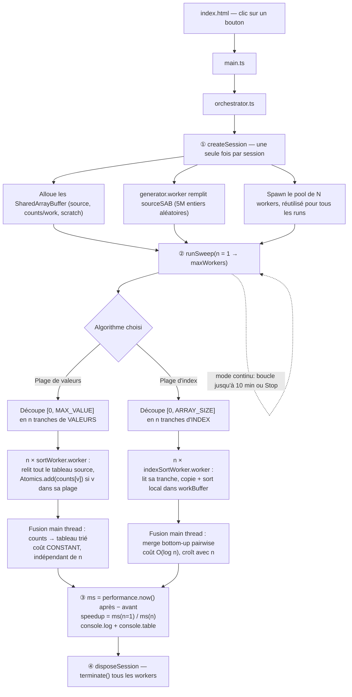

# test_workers

Benchmark de Web Workers : trouver le "sweet spot" du nombre de workers pour
paralléliser un calcul lourd, en mesurant le temps (ms) et le speedup par
rapport à un run à 1 seul worker.

## Le calcul

Tri par comptage (counting sort) de 5 000 000 d'entiers aléatoires (valeurs
entre 0 et 5 000 000). Ce tri se parallélise naturellement en découpant
l'espace des **valeurs** (et non les index) entre N workers : chaque worker
scanne tout le tableau source mais ne compte que les occurrences de sa
sous-plage de valeurs. Le volume de travail total (5M comptages) est donc
constant quel que soit N, ce qui rend la comparaison entre différents nombres
de workers équitable.

Le tableau source aléatoire est lui-même généré dans un worker dédié : le
thread principal n'est jamais bloqué, y compris pendant la préparation des
données de test.

## Partage des données : SharedArrayBuffer

Le tableau source (20 Mo) et le tableau de comptage sont des
`SharedArrayBuffer`, partagés par référence avec tous les workers sans aucune
copie, quel que soit le nombre de workers. Les alternatives ont été écartées :
- `postMessage` classique copierait le tableau à chaque worker (coût qui
  croît avec N et fausserait la mesure de speedup) ;
- un `ArrayBuffer` transférable détruit l'ownership au transfert, incompatible
  avec plusieurs workers lisant le même tableau simultanément.

Les écritures concurrentes dans le tableau de comptage utilisent
`Atomics.add` (garantie de visibilité mémoire inter-agents pour un
`SharedArrayBuffer`).

`SharedArrayBuffer` exige un contexte cross-origin isolé
(`self.crossOriginIsolated === true`), fourni ici via les headers
`Cross-Origin-Opener-Policy: same-origin` et
`Cross-Origin-Embedder-Policy: require-corp` configurés dans
`vite.config.ts` (dev server et `vite preview`). **Ces headers ne sont pas
automatiquement présents sur un déploiement statique** (Netlify, Vercel,
Nginx...) : il faudra les reconfigurer côté hébergeur pour toute mise en
production.

## Flow



Points clés :
- Le pool de workers et les buffers sont créés **une seule fois par session**
  (pas à chaque run) : sinon le coût de spawn/allocation croîtrait avec le
  nombre de runs et fausserait la mesure (et finissait par faire planter la
  page sur les sessions longues).
- La différence entre les deux algorithmes se joue uniquement dans le
  découpage et la fusion : "plage de valeurs" paie des lectures redondantes
  mais a une fusion à coût fixe (scale loin) ; "plage d'index" paie une
  fusion qui grossit avec N (plafonne plus tôt).
- Rien ne touche le main thread pendant le calcul lourd : génération, comptage
  et tri se font tous dans des workers ; le main thread ne fait que
  `performance.now()`, `Promise.all` et la fusion finale (rapide).

## Lancer le benchmark

```bash
npm install
npm run dev
```

Ouvrir l'URL locale affichée, choisir un nombre max de workers, cliquer sur
"Lancer le benchmark". Les résultats détaillés (temps par run, speedup) et un
tableau récapitulatif s'affichent dans la console du navigateur.
