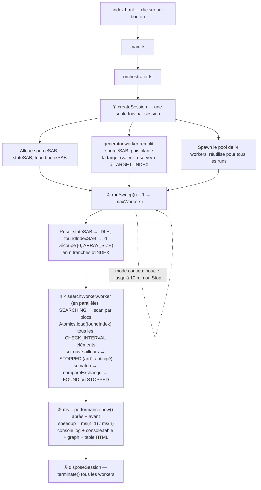

# test_workers

Benchmark de Web Workers : trouver le "sweet spot" du nombre de workers pour
paralléliser une recherche, en mesurant le temps (ms) et le speedup par
rapport à un run à 1 seul worker.

## Le calcul

Recherche d'une **target fixe** (même index à chaque run, pour que les temps
soient comparables d'un nombre de workers à l'autre) dans un tableau de
5 000 000 d'entiers aléatoires, réparti en N tranches d'index égales entre N
workers.

Le point central du projet n'est pas la recherche elle-même (triviale), mais
la **coordination entre workers via `Atomics`** : chaque worker scanne sa
tranche par blocs et vérifie périodiquement (toutes les `CHECK_INTERVAL`
itérations) un flag partagé — si un autre worker a déjà trouvé la target, il
s'arrête immédiatement au lieu de scanner inutilement le reste de sa
tranche. C'est ça, la "vraie" parallélisation démontrée ici : pas juste
diviser le travail, mais aussi arrêter le travail devenu inutile dès que
l'information est disponible, sans passer par un message.

Chaque worker traverse aussi une machine à états simple, observable en
direct depuis le main thread (lecture `Atomics.load` sur un buffer partagé,
sans coût de communication) :

```
IDLE → SEARCHING → FOUND      (le worker qui trouve la target)
             ↳   → STOPPED    (un autre worker a trouvé en premier)
             ↳   → IDLE       (tranche épuisée, rien trouvé, personne d'autre non plus pour l'instant)
```

**Target fixe et déterministe** : le tableau source est rempli aléatoirement
avec des valeurs dans `[0, MAX_VALUE - 1]`, puis la valeur `MAX_VALUE`
(réservée, donc garantie unique) est placée à un index fixe,
`TARGET_INDEX = 95% × ARRAY_SIZE` — volontairement proche de la fin du
tableau : pire cas pour un run à 1 worker (il doit scanner ~95% du tableau
avant de trouver), donc bon cas pour observer le gain apporté par le
découpage ET par l'arrêt anticipé coopératif.

Le tableau source aléatoire est lui-même généré dans un worker dédié : le
thread principal n'est jamais bloqué, y compris pendant la préparation des
données de test.

## Coordination : Atomics sur SharedArrayBuffer

Trois `SharedArrayBuffer` sont partagés par référence avec tous les workers
d'une session (alloués une seule fois, réutilisés à travers tous les
runs/itérations) :
- **`sourceSAB`** (20 Mo) — le tableau à chercher, lecture seule pendant les
  runs.
- **`foundIndexSAB`** (1 entier) — initialisé à `-1` avant chaque run. Le
  premier worker à trouver la target fait
  `Atomics.compareExchange(foundIndex, 0, -1, monIndex)` : l'opération est
  atomique, donc même si (en théorie) deux workers trouvaient une
  correspondance au même instant, un seul "gagnerait" l'échange — c'est ce
  qui garantit qu'il n'y a qu'un seul `FOUND` par run, sans race condition.
- **`stateSAB`** (1 entier par worker) — l'état courant de chaque worker
  (voir machine à états ci-dessus), mis à jour via `Atomics.store` et lu par
  les autres workers (`Atomics.load`, dans la boucle de scan, toutes les
  `CHECK_INTERVAL` itérations) et par le main thread (pour l'affichage).

Aucune copie de tableau entre main thread et workers, quel que soit le
nombre de workers — un `SharedArrayBuffer` est cloné par référence en O(1).

`SharedArrayBuffer` exige un contexte cross-origin isolé
(`self.crossOriginIsolated === true`), fourni ici via les headers
`Cross-Origin-Opener-Policy: same-origin` et
`Cross-Origin-Embedder-Policy: require-corp`. Ces headers sont configurés à
deux endroits distincts, car aucun des deux ne couvre l'autre cas :
- `vite.config.ts` (`server.headers` / `preview.headers`) — pour `npm run
  dev` et `npm run preview` en local.
- `vercel.json` (`headers`) — pour le déploiement statique sur Vercel, qui ne
  passe jamais par le serveur Vite et ignore donc `vite.config.ts`.

**Sur un autre hébergeur statique** (Netlify, Nginx, GitHub Pages...), il
faudra reconfigurer ces deux headers dans le mécanisme propre à cet
hébergeur (`_headers` pour Netlify, bloc `add_header` pour Nginx, etc.).

## Flow



Points clés :
- Le pool de workers et les buffers sont créés **une seule fois par session**
  (pas à chaque run) : sinon le coût de spawn/allocation croîtrait avec le
  nombre de runs et fausserait la mesure (et finissait par faire planter la
  page sur les sessions longues).
- **Le main thread n'exécute jamais de calcul lourd** : génération et
  recherche se font entièrement dans les workers. Le main thread ne fait que
  `performance.now()`, `Promise.all`, lire les états via `Atomics.load` pour
  l'affichage, et logguer les résultats — il reste réactif pendant toute la
  durée du run.
- L'intérêt de la coordination se lit directement dans les logs : plus N
  grandit, plus la proportion de workers `stopped-early` (par rapport à
  `found`/`not-found`) augmente — c'est la preuve visible que l'arrêt
  anticipé fonctionne, pas juste que le travail est divisé.

## Lancer le benchmark

```bash
npm install
npm run dev
```

Ouvrir l'URL locale affichée, choisir un nombre max de workers, cliquer sur
"Lancer un one-shot" (un run par nombre de workers, de 1 à N) ou "Démarrer
(10 min)" (sweep répété en boucle, pour vérifier la stabilité). Les résultats
détaillés (temps par run, speedup, état de chaque worker) s'affichent dans la
console du navigateur, dans un graphique et dans un tableau sur la page.
